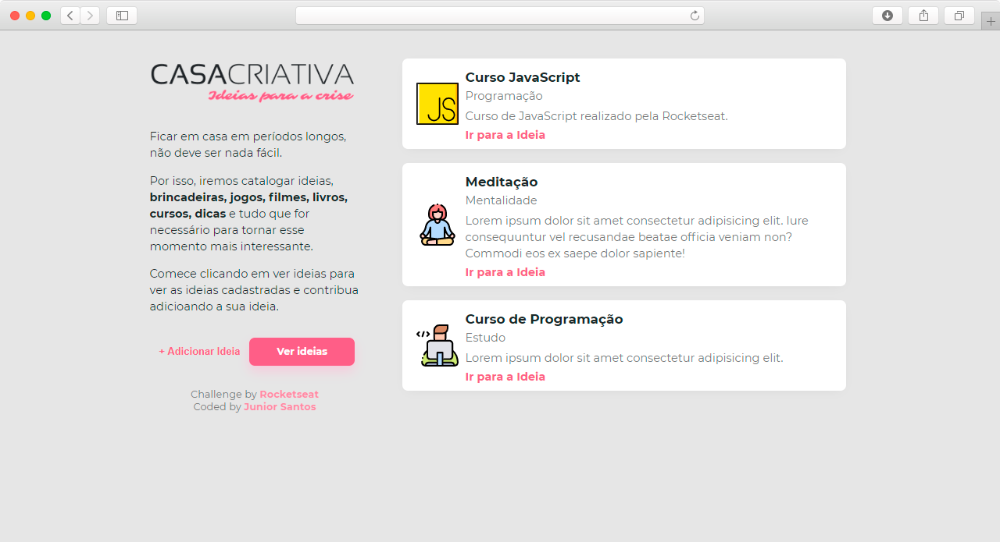
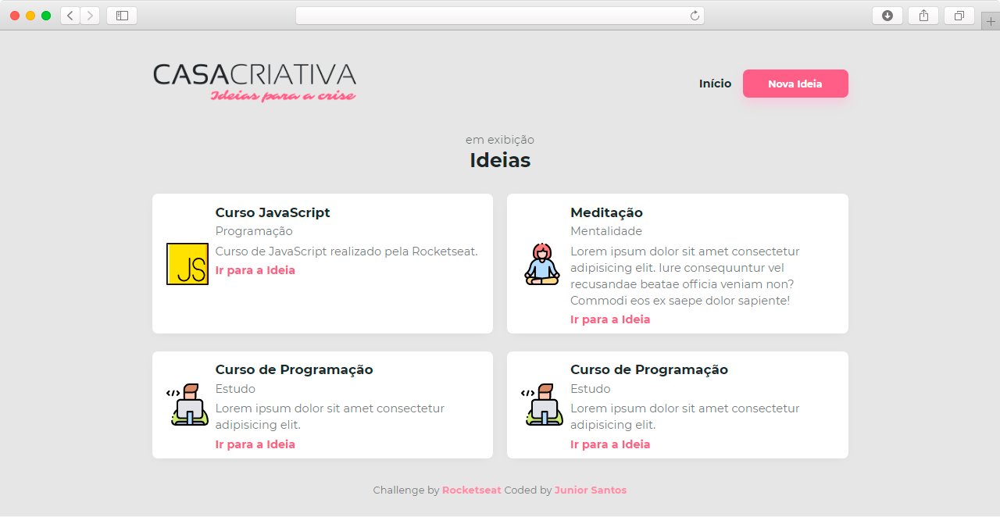
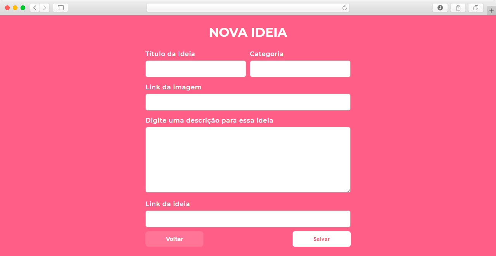

<h1 align="center">
    
</h1>

------

### :house: Descrição do Projeto

Projeto desenvolvido através do WorkshopDev Especial que foi realizado pela [Rocketseat](https://rocketseat.com.br/).

Onde o instrutor [Mayk Brito](https://github.com/maykbrito) ensinou a desenvolver uma aplicação utilizando tecnologias como Node.js, Express, Nunjucks e Sqlite3.

O projeto desenvolvido foi o site Casa Criativa: Ideias para a crise, que tem como objetivo inserir e armazenar ideias de atividades, que podem ser realizadas durante a quarentena do COVID-19.

------

### :house: Funcionalidades

:trophy: Cadastramento de Informações (Ideias)

:trophy: Visualizar as informações cadastradas (ideias)

------

<h3 align="center">
    Layout da aplicação
</h3>

------

#### :computer: Tela Inicial

<h4 align="center">
    
</h4>

------

#### :computer: Tela de Ideias cadastradas

<h4 align="center">
    
</h4>

------

#### :computer: Tela de cadastro de novas ideias

<h4 align="center">
    
</h4>

------

### :house: Dependências

:vertical_traffic_light: Node.js: ^v12.18.0 - Eexpress: ^4.17.1 - Nunjucks: ^3.2.1 - Sqlite3: ^4.2.0

-----

### :house: Banco de Dados

Foi utilizando o SQLITE3 para gerenciar o banco de Dados. Abaixo descrição da Estrutura da tabela **ideias** no banco de dados.

| id | image | title | category | description |link|
| --- | --- | --- | --- | --- | --- |
|INTEGER PRIMARY KEY AUTOINCREMENT| text | text | text | text | text |

------
#### :house: Atualizações pessoais:

- [ ] Adaptar a **Responsividade** do site.

- [ ] Realizar alterações nas informações cadastradas.

- [ ] Deletar informações cadastradas.

### :house: Status do Projeto: Em desenvolvimento :construction:

------

### :pencil: Licença

	Copyright (c) 2020 Edvan Ribeiro
     
    Esse projeto está sob a licença MIT. Veja o arquivo <a href="https://github.com/ejunior01/projetos_by_rocketseat/blob/master/LICENSE">LICENSE</a> para mais detalhes.

