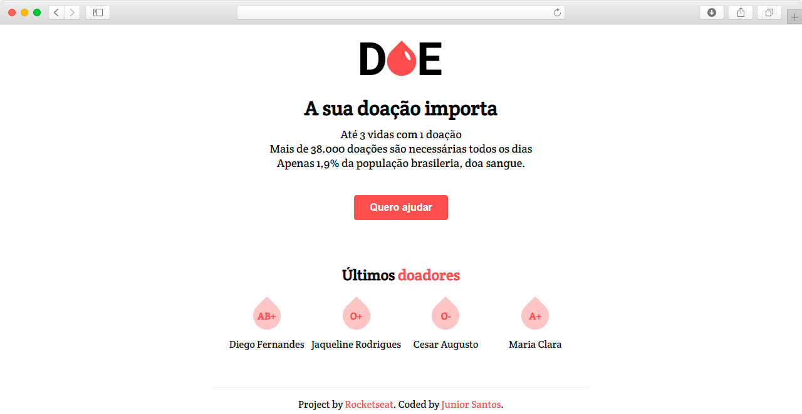

<h1 align="center">
    
</h1>
<p align="center">
  <a href="https://rocketseat.com.br">
    
  </a>
<p/>

------

### 🩸 Descrição do Projeto

Projeto desenvolvido através da 3º edição da MaratonaDev, que foi realizado pela [Rocketseat](https://rocketseat.com.br/).

Onde o instrutor nos ensina a desenvolver uma aplicação completa com Backend e Frontend, utilizando tecnologias  no Backend como Node.js, Express, Nunjucks e PostegresSQL.

O projeto DOE, tem como objetivo realizar o cadastramento de voluntários que deseja realizar doações de sangue, e armazenar em uma base de dados para consultas futuras.

------

### 🩸 Funcionalidades

 :trophy: Cadastramento dos voluntários.

 :trophy: Visualizar as informações dos últimos quatro doadores.

------

<h3 align="center">
   Layout da aplicação
</h3>

------

#### :computer: Tela Inicial

<h4 align="center">
    
</h4>

------
### 🩸 Dependências

:vertical_traffic_light: [Node.js](https://nodejs.org/en/)

:vertical_traffic_light: [express](https://expressjs.com/pt-br/)

:vertical_traffic_light: [nunjucks](https://mozilla.github.io/nunjucks/)

:vertical_traffic_light: [sqlite3](https://www.sqlite.org/index.html)

:vertical_traffic_light: [nodemon](https://www.npmjs.com/package/nodemon)

---

### 🩸 Banco de Dados

Foi utilizando o PostegresSQL para gerenciar o banco de Dados. Abaixo descrição da estrutura da tabela **donors** no banco de dados.

| id | name | email | blood |
| --- | --- | --- | --- |
| integer NOT NULL DEFAULT nextval | text | text | text |

PostegresSQL criação do banco de dados e tabela:

```
# Query criação do banco de Dados
CREATE DATABASE doe
    WITH 
    OWNER = postgres
    ENCODING = 'UTF8'
    LC_COLLATE = 'Portuguese_Brazil.1252'
    LC_CTYPE = 'Portuguese_Brazil.1252'
    TABLESPACE = pg_default
    CONNECTION LIMIT = -1;
    
# Query criação e configurações da tabela donors

CREATE TABLE public.donors
(
    id integer NOT NULL DEFAULT nextval('donors_id_seq'::regclass),
    name text COLLATE pg_catalog."default" NOT NULL,
    email text COLLATE pg_catalog."default" NOT NULL,
    blood text COLLATE pg_catalog."default" NOT NULL,
    CONSTRAINT donors_pkey PRIMARY KEY (id)
)

TABLESPACE pg_default;

ALTER TABLE public.donors
    OWNER to postgres;
```

------
#### Atualizações:

- [ ] Adaptar a **Responsividade** do site.

- [ ] Usar lista de seleção para tipos sanguíneos.

### 🩸 Status do Projeto: Concluído :construction:

------

### :pencil: Licença

<p align="center">
	Copyright (c) 2020 Edvan Ribeiro
    <br/>
    Esse projeto está sob a licença MIT. Veja o arquivo <a href="https://github.com/ejunior01/projetos_by_rocketseat/blob/master/LICENSE">LICENSE</a> para mais detalhes.
</p>

