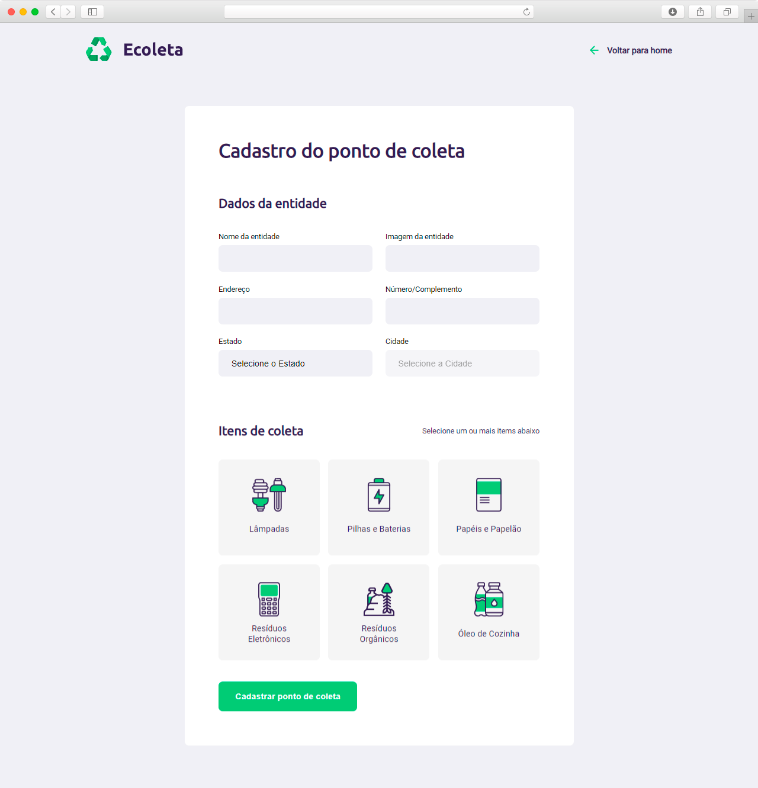

<h1 align="center">
    
</h1>

------

### :recycle: Descrição do Projeto

Projeto desenvolvido através do **Next Level Week** by  [Rocketseat](https://rocketseat.com.br/) entre os dias 01/06 e 05/06. 

Projeto foi desenvolvido com a instrução de [Mayk Brito](https://github.com/maykbrito), onde foi ensina a desenvolver uma aplicação com  Frontend e Backend. Utilizando tecnologias no Backend como Node.js, Express, Nunjucks e Sqlite3, e no Frontend HTML, CSS e JavaScript.

A aplicação construída foi o Site **Ecoleta**, com o princípio de ser um local para busca de empresas que coletem resíduos recicláveis, e que precisam de descarte em locais próprios. E onde essas empresas de coletas de resíduos, através do site irão realizar o cadastro.

Foi utilizado no projeto a API do [IBGE](https://servicodados.ibge.gov.br/api/docs/localidades?versao=1)  para popular os dados referentes a Estados e Cidades do Brasil.

------

### :recycle: Funcionalidades do Site Ecoleta

:trophy: Cadastramento dos pontos de coletas pelas empresas.

:trophy: Buscas por pontos de coletas cadastrados. 

----

<h3 align="center">
    Layout da aplicação
</h3>

------

#### :computer: Tela Inicial

<h4 align="center">
    
</h4>

------

#### :computer: Tela Cadastro pontos de coletas

<h4 align="center">
    
</h4>

------

#### :computer: Tela Resultados da busca

<h4 align="center">
    
</h4>

------

### :recycle: Dependências

:vertical_traffic_light: [Node.js](https://nodejs.org/en/)

:vertical_traffic_light: [express](https://expressjs.com/pt-br/)

:vertical_traffic_light: [nunjucks](https://mozilla.github.io/nunjucks/)

:vertical_traffic_light: [sqlite3](https://www.sqlite.org/index.html)

:vertical_traffic_light: [nodemon](https://www.npmjs.com/package/nodemon)

------

### :recycle: Banco de Dados

Foi utilizando o SQLITE3 para gerenciar o banco de Dados. Abaixo descrição da Estrutura da tabela **places** no banco de dados.

| id| name| image |address | address2 |state|city|items|
|--|--|--|--|--|--|--|--|
|INTEGER PRIMARY KEY AUTOINCREMENT|text|text|text|text|text|text|text|

------

#### Tarefas em aberto:

- [ ] Adaptar a **Responsividade** do site.
- [ ] Adicionar busca por Estado.
- [ ] Adicionar campo de URL do site da empresa cadastrada.
- [ ] Resposta visual para erros no cadastro.

### :recycle: Status do Projeto: Em desenvolvimento :construction:
------

### :pencil: Licença

	Copyright (c) 2020 Edvan Ribeiro
     
    Esse projeto está sob a licença MIT. Veja o arquivo <a href="https://github.com/ejunior01/projetos_by_rocketseat/blob/master/LICENSE">LICENSE</a> para mais detalhes.

